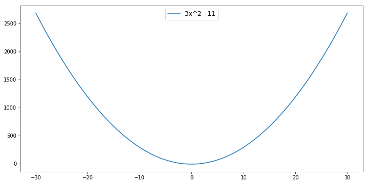
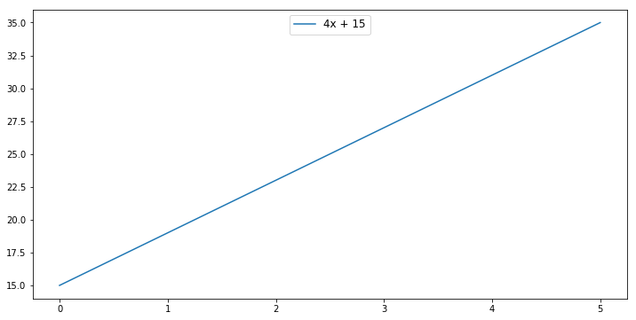
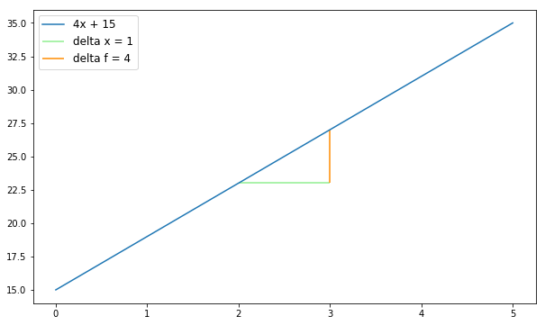

# Derivatives of Linear Functions Lab

### Introduction: Start here

In this lab, we will practice our knowledge of derivatives. Remember that our key formula for derivatives, is 
$f'(x) = \dfrac{\Delta y}{\Delta x} =  \dfrac{f(x + \Delta x) - f(x)}{\Delta x}$.  So in driving towards this formula, we will do the following: 

1. Learn how to represent linear and nonlinear functions in code 
2. Then, because our calculation of a derivative relies on seeing the output at an initial value and the output at that value plus $\Delta x$, we need an `output_at` function
3. Then we will be able to code the $\Delta f$ function that sees the change in output between the initial $x$ and that initial $x$ plus the $\Delta x$ 
4. Finally, we will calculate the derivative at a given $x$ value, `derivative_at` 

### Learning objectives 

For this first section, you should be able to answer all of the question with an understanding of our definition of a derivative:

1. Our intuitive explanation that a derivative is the instantaneous rate of change of a function
2. Our mathematical definition is that  $f'(x) = \dfrac{\Delta y}{\Delta x} =  \dfrac{f(x + \Delta x) - f(x)}{\Delta x}$

### Let's begin: Starting with functions

#### 1. Representing Functions

We are about to learn to take the derivative of a function in code.  But before doing so, we need to learn how to express any kind of function in code.  This way when we finally write our functions for calculating the derivative, we can use them with both linear and nonlinear functions.

For example, we want to write the function $f(x) = 2x^2 + 4x - 10 $ in a way that allows us to easily determine the exponent of each term.

This is our technique: write the formula as a list of tuples.  

> A tuple is a list whose elements cannot be reassigned.  But everything else, for our purposes, is the same.  
```python
tuple = (7, 3)
tuple[0] # 7
tuple[1] # 3
```

> We get a TyperError if we try to reassign the tuple's elements.
```python
tuple[0] = 7
# TypeError: 'tuple' object does not support item assignment
```

Take the following function as an example: 

$$f(x) = 4x^2 + 4x - 10 $$

Here it is as a list of tuples:


```python
tuple_1 = [(4, 2), (4, 1), (-10, 0)]
```

So each tuple in the list represents a different term in the function.  The first element of the tuple is the term's constant and the second element of the tuple is the term's exponent.  Thus $4x^2$ translates to `(4, 2)` and  $-10$ translates to `(-10, 0)` because $-10$ equals $-10*x^0$.  
> We'll refer to this list of tuples as "list of terms", or `list_of_terms`.

Ok, so give this a shot. Write $ f(x) = 4x^3 + 11x^2 $ as a list of terms.  Assign it to the variable `tuple_2`. (***formerly `four_x_cubed_plus_eleven_x_squared`***)


```python
tuple_2 = [(4, 3), (11, 2)]
```

#### 2. Evaluating a function at a specific point 

Now that we can represent a function in code, let's write a Python function called `term_output` that can evaluate what a single term equals at a value of $x$.  

* For example, when $x = 2$, the term $3x^2 = 3*2^2 = 12 $.  
* So we represent $3x^2$ in code as `(3, 2)`, and: 
* `term_output((3, 2), 2)` should return 12


```python
def term_output(term, input_value):
    return term[0]*input_value**term[1]
```


```python
term_output((3, 2), 2) # 12
```


    12


> **Hint:** To raise a number to an exponent in python, like 3^2 use the double star, as in:
```python
3**2 # 9 
```

Now write a function called `output_at`, when passed a `list_of_terms` and a value of $x$, calculates the value of the function at that value.  
* For example, we'll use `output_at` to calculate $f(x) = 3x^2 - 11$.  
* Then `output_at([(3, 2), (-11, 0)], 2)` should return $f(2) = 3*2^2 - 11 = 1$. Store `[(3, 2), (-11, 0)]` as `tuple_3`.


```python
def output_at(list_of_terms, x_value):
    outputs = list(map(lambda term: term_output(term, x_value), list_of_terms))
    return sum(outputs)
```


```python
tuple_3 = [(3, 2), (-11, 0)]
```

Verify that $f(2) = 3*2^2 - 11 = 1$.


```python
output_at(tuple_3, 2) # 1 
```


    1


What value does $f(3)$ return?


```python
output_at(tuple_3, 3) # 16
```


    16


Now we can use our `output_at` function to display our function graphically.  We simply declare a list of `x_values` and then calculate `output_at` for each of the `x_values`.


```python
import numpy as np
import matplotlib.pyplot as plt

fig, ax = plt.subplots(figsize=(12,6))
x_values = np.linspace(-30, 30, 100)
y_values = list(map(lambda x: output_at(tuple_3, x), x_values))

plt.plot(x_values, y_values, label = "3x^2 - 11")

ax.legend(loc="upper center",fontsize='large')

plt.show()
```





### Moving to derivatives of linear functions

Let's start with a function, $f(x) = 4x + 15$.  We represent the function as the following:


```python
lin_function = [(4, 1), (15, 0)]
```

We can plot the function by calculating outputs at a range of x values.  Note that we use our `output_at` function to calculate the output at each individual x value.


```python
fig, ax = plt.subplots(figsize=(12,6))
x_values = np.linspace(0, 5, 100)
y_values = list(map(lambda x: output_at(lin_function, x), x_values))

plt.plot(x_values, y_values, label = "4x + 15")

ax.legend(loc="upper center",fontsize='large')

plt.show()
```





Ok, time to do what we are here for: *derivatives*.  Remember that the derivative is the instantaneous rate of change of a function, and is expressed as:

$$ f'(x) = \frac{\Delta f}{\Delta x}  = \frac{f(x + \Delta x) - f(x)}{\Delta x}  $$ 

#### Writing a function for $\Delta f$

We can see from the formula above that  $\Delta f = f(x + \Delta x ) - f(x) $.  Write a function called `delta_f` that, given a `list_of_terms`, an `x_value`, and a value $\Delta x $, returns the change in the output over that period.
> **Hint** Don't forget about the `output_at` function.  The `output_at` function takes a list of terms and an $x$ value and returns the corresponding output.  So really **`output_at` is equivalent to $f(x)$**, provided a function and a value of x.


```python
def delta_f(list_of_terms, x_value, delta_x):
    return output_at(list_of_terms, x_value + delta_x) - output_at(list_of_terms, x_value)
```


```python
delta_f(lin_function, 2, 1) # 4
```


    4


So for $f(x) = 4x + 15$, when $x$ = 2, and $\Delta x = 1$, $\Delta f$ is 4.  

#### Plotting our function, delta f, and delta x  

Let's show $\Delta f$ and $\Delta x$ graphically.


```python
x_value = 2
delta_x = 1
```


```python
fig, ax = plt.subplots(figsize=(10,6))

x_values = np.linspace(0, 5, 100)
y_values = list(map(lambda x: output_at(lin_function, x), x_values))

plt.plot(x_values, y_values, label = "4x + 15")

# delta x
y_val = output_at(lin_function, x_value)
hline_lab= 'delta x = ' + str(delta_x)
plt.hlines(y=y_val, xmin= x_value, xmax= x_value + delta_x, color="lightgreen", label = hline_lab)

# delta f
y_val_max = output_at(lin_function, x_value + delta_x)
vline_lab =  'delta f = ' + str(y_val_max-y_val)
plt.vlines(x = x_value + delta_x , ymin= y_val, ymax=y_val_max, color="darkorange", label = vline_lab)
ax.legend(loc='upper left', fontsize='large')

plt.show()
```





#### Calculating the derivative

Write a function, `derivative_at` that calculates $\frac{\Delta f}{\Delta x}$ when given a `list_of_terms`, an `x_value` for the value of $(x)$ the derivative is evaluated at, and `delta_x`, which represents $\Delta x$.  

Let's try this for $f(x) = 4x + 15 $.  Round the result to three decimal places.


```python
def derivative_of(list_of_terms, x_value, delta_x):
    delta = delta_f(list_of_terms, x_value, delta_x)
    return round(delta/delta_x, 3)
```


```python
derivative_of(lin_function, 3, 2) # 4.0
```


    4.0


### We do: Building more plots

Ok, now that we have written a Python function that allows us to plot our list of terms, we can write a function that called `derivative_trace` that shows the rate of change, or slope, for the function between initial x and initial x plus delta x. We'll walk you through this one.  


```python
def derivative_trace(list_of_terms, x_value, line_length = 4, delta_x = .01):
    derivative_at = derivative_of(list_of_terms, x_value, delta_x)
    y = output_at(list_of_terms, x_value)
    x_minus = x_value - line_length/2
    x_plus = x_value + line_length/2
    y_minus = y - derivative_at * line_length/2
    y_plus = y + derivative_at * line_length/2
    return trace_values([x_minus, x_value, x_plus],[y_minus, y, y_plus], name = "f' (x) = " + str(derivative_at), mode = 'line')
```

> Our `derivative_trace` function takes as arguments `list_of_terms`, `x_value`, which is where our line should be tangent to our function, `line_length` as the length of our tangent line, and `delta_x` which is our $\Delta x$.

> The return value of `derivative_trace` is a dictionary that represents tangent line at that values of $x$.  It uses the `derivative_of` function you wrote above to calculate the slope of the tangent line.  Once the slope of the tangent is calculated, we stretch out this tangent line by the `line_length` provided.  The beginning x value is just the midpoint minus the `line_length/2` and the ending $x$ value is midpoint plus the `line_length/2`.  Then we calculate our $y$ endpoints by starting at the $y$ along the function, and having them ending at `line_length/2*slope` in either direction. 


```python
tangent_line_four_x_plus_fifteen = derivative_trace(lin_function, 2, line_length = 4, delta_x = .01)
tangent_line_four_x_plus_fifteen
```


    ---------------------------------------------------------------------------

    NameError                                 Traceback (most recent call last)

    <ipython-input-27-8a91c0590f7e> in <module>()
    ----> 1 tangent_line_four_x_plus_fifteen = derivative_trace(lin_function, 2, line_length = 4, delta_x = .01)
          2 tangent_line_four_x_plus_fifteen


    <ipython-input-25-0a3baaf75771> in derivative_trace(list_of_terms, x_value, line_length, delta_x)
          6     y_minus = y - derivative_at * line_length/2
          7     y_plus = y + derivative_at * line_length/2
    ----> 8     return trace_values([x_minus, x_value, x_plus],[y_minus, y, y_plus], name = "f' (x) = " + str(derivative_at), mode = 'line')
    

    NameError: name 'trace_values' is not defined


Now we provide a function that simply returns all three of these traces.


```python
def delta_traces(list_of_terms, x_value, line_length = 4, delta_x = .01):
    tangent = derivative_trace(list_of_terms, x_value, line_length, delta_x)
    delta_f_line = delta_f_trace(list_of_terms, x_value, delta_x)
    delta_x_line = delta_x_trace(list_of_terms, x_value, delta_x)
    return [tangent, delta_f_line, delta_x_line]
```

Below we can plot our trace of the function as well 


```python
delta_x = 1

# derivative_traces(list_of_terms, x_value, line_length = 4, delta_x = .01)
three_x_plus_tangents = delta_traces(four_x_plus_fifteen, 2, line_length= 2*1, delta_x = delta_x)
# {'x': [1.5, 2, 2.5], 'y': [2.0, 4, 6.0]}
plot([four_x_plus_fifteen_trace, *three_x_plus_tangents])

```


<div id="b6206db9-76db-433e-ac02-3292b57ae469" style="height: 525px; width: 100%;" class="plotly-graph-div"></div><script type="text/javascript">require(["plotly"], function(Plotly) { window.PLOTLYENV=window.PLOTLYENV || {};window.PLOTLYENV.BASE_URL="https://plot.ly";Plotly.newPlot("b6206db9-76db-433e-ac02-3292b57ae469", [{"x": [0, 1, 2, 3, 4, 5], "y": [15, 19, 23, 27, 31, 35], "mode": "line", "name": "data", "text": []}, {"x": [1.0, 2, 3.0], "y": [19.0, 23, 27.0], "mode": "line", "name": "f' (x) = 4.0", "text": []}, {"x": [3, 3], "y": [23, 27], "mode": "line", "name": "delta f = 4", "text": []}, {"x": [2, 3], "y": [23, 23], "mode": "line", "name": "delta x = 1", "text": []}], {}, {"showLink": true, "linkText": "Export to plot.ly"})});</script>


So that function highlights the rate of change is moving at precisely the point x = 2.  Sometimes it is useful to see how the derivative is changing across all x values.  With linear functions we know that our function is always changing by the same rate, and therefore the rate of change is constant.  Let's write a function that allows us to see the function, and the derivative side by side.


```python
from graph import make_subplots, trace_values, plot_figure

def function_derivative_compared_trace(list_of_terms, x_values, delta_x):
    function_values = list(map(lambda x: output_at(list_of_terms, x),x_values))
    derivative_values = list(map(lambda x: derivative_of(list_of_terms, x, delta_x), x_values))
    function_trace = trace_values(x_values, function_values, mode = 'line')
    derivative_trace = trace_values(x_values, derivative_values, mode = 'line')
    return make_subplots([function_trace], [derivative_trace])

comapared_four_x_plut_fifteen = function_derivative_compared_trace(four_x_plus_fifteen, list(range(0, 7)), 1)

plot_figure(comapared_four_x_plut_fifteen )
```

    This is the format of your plot grid:
    [ (1,1) x1,y1 ]  [ (1,2) x2,y2 ]
    


<div id="1eb8a058-cb95-427e-854e-bf900bc76b15" style="height: 525px; width: 100%;" class="plotly-graph-div"></div><script type="text/javascript">require(["plotly"], function(Plotly) { window.PLOTLYENV=window.PLOTLYENV || {};window.PLOTLYENV.BASE_URL="https://plot.ly";Plotly.newPlot("1eb8a058-cb95-427e-854e-bf900bc76b15", [{"type": "scatter", "x": [0, 1, 2, 3, 4, 5, 6], "y": [15, 19, 23, 27, 31, 35, 39], "mode": "line", "name": "data", "text": [], "xaxis": "x1", "yaxis": "y1"}, {"type": "scatter", "x": [0, 1, 2, 3, 4, 5, 6], "y": [4.0, 4.0, 4.0, 4.0, 4.0, 4.0, 4.0], "mode": "line", "name": "data", "text": [], "xaxis": "x2", "yaxis": "y2"}], {"xaxis1": {"domain": [0.0, 0.45], "anchor": "y1"}, "yaxis1": {"domain": [0.0, 1.0], "anchor": "x1"}, "xaxis2": {"domain": [0.55, 1.0], "anchor": "y2"}, "yaxis2": {"domain": [0.0, 1.0], "anchor": "x2"}}, {"showLink": true, "linkText": "Export to plot.ly"})});</script>


### Summary

In this section, we coded out our function for calculating and plotting the derivative.  We started with seeing how we can represent different types of functions.  Then we moved onto writing the `output_at` function which evaluates a provided function at a value of x.  We calculated `delta_f` by subtracting the output at initial x value from the output at that initial x plus delta x.  After calculating `delta_f`, we moved onto our `derivative_at` function, which simply divided `delta_f` from `delta_x`.  

In the final section, we introduced some new functions, `delta_f_trace` and `delta_x_trace` that plot our deltas on the graph.  Then we introduced the `derivative_trace` function that shows the rate of change, or slope, for the function between initial x and initial x plus delta x.
